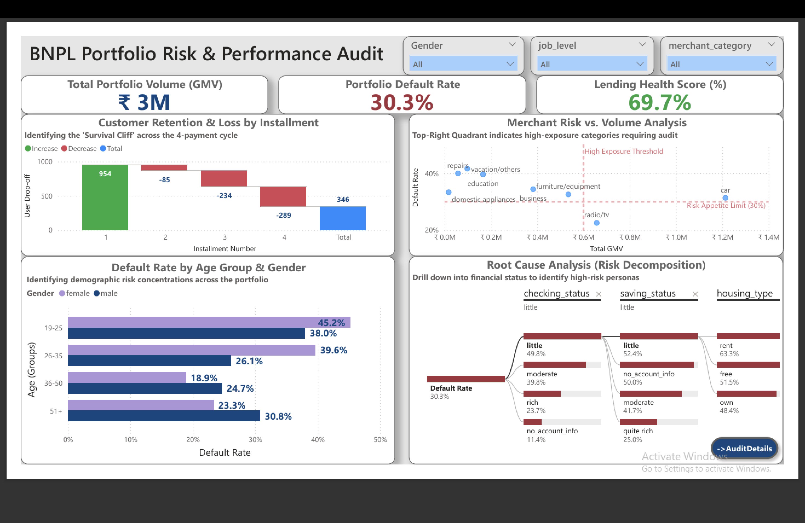

# BNPL Merchant & Portfolio Risk Audit
Auditing Default Patterns and Merchant Risk Across a 4-Payment BNPL Installment Cycle

### [View Project Architecture](./sql-scripts/database_schema_guide.md) | [View Dashboard Files](./dashboard-files/)

---

## 📌 Project Overview
This project is a comprehensive risk audit of a Buy-Now-Pay-Later (BNPL) lending portfolio. By transforming raw credit records into a simulated 4-part installment lifecycle, I evaluated how socio-economic profiles and financial stability markers influence payment durability. The analysis pinpoints "Survival Cliffs" in the repayment journey and maps merchant-level exposure to help lenders distinguish between high-growth opportunities and systemic credit risks.

## 🛠️ Tech Stack
* **Data Warehouse:** Google BigQuery (SQL)
* **Data Engineering:** SQL-driven ETL (Cleaning, Normalization, & Installment Logic)
* **Data Modeling:** Relational Star Schema (Dimension & Fact Tables)
* **Visualization:** Power BI (DAX, Survival Waterfall Charts, Merchant Risk Audits)

## 📈 Key Audit Insights
* **The Survival Cliff (Waterfall Analysis):** Portfolio health experiences a sharp decline mid-cycle. While 954 users successfully complete the first installment, a **cumulative drop-off of ~63%** occurs by the final payment, identifying the 3rd and 4th installments as the stages of highest capital loss.
* **Merchant Exposure (Risk vs. Volume):** Several categories act as "Risk Outliers." **Repairs, Education, and Vacation** categories show default rates exceeding **40%**, placing them significantly above the 30% Risk Appetite Limit, despite having lower total transaction volumes (GMV).
* **Demographic Concentration (Age & Gender):** Younger cohorts represent the highest credit risk. Users in the **19-25 and 26-35 age brackets** exhibit default rates between **38% and 45.2%**, contrasting sharply with the 36-50 bracket, which maintains the healthiest repayment profile.
* **Root Cause Decomposition (Financial Stability):** Financial markers are the strongest predictors of default. The risk audit reveals that users with **"Little" checking/savings status who also rent their homes** reach a staggering **63.3% default rate**, whereas homeowners with "Rich" account status represent the safest lending segment.

## 🖥️ Dashboard Features

### **Key Performance Indicators (KPIs)**
* **Total Portfolio Volume (GMV):** High-level tracking of the total loan book value (₹3M).
* **Portfolio Default Rate:** The primary audit metric, currently identifying a **30.3%** non-payment rate across the ecosystem.
* **Lending Health Score:** A custom inverse metric showing the percentage of the portfolio currently in "Good" standing (**69.7%**).

### **Analytical Visuals**
* **Installment Survival Waterfall:** Tracks user "drop-off" across the 4-payment lifecycle, providing a clear visual of where the portfolio loses ~63% of its volume.
* **Risk vs. Volume Quadrant (Scatter Plot):** Maps merchant categories against a **30% Risk Appetite Limit** line to instantly identify high-exposure outliers like Repairs and Education.
* **Demographic Risk Profiler:** A multi-layered analysis comparing default rates across Age Groups and Gender to identify specific high-risk personas.
* **Root Cause Decomposition Tree:** An interactive visual that allows auditors to drill down from the total default rate into specific combinations of financial markers (Checking Status → Savings Status → Housing Type).

### Interactive Global Slicers:
* **Allows for instant portfolio filtering by Job Level, Merchant Category & Gender to observe how risk profiles shift across different segments.**

## 💡 Strategic Recommendations

* **Implement "Mid-Cycle" Interventions:** Since the "Survival Cliff" peaks at the 3rd installment, the lending team should deploy automated SMS/Email reminders 48 hours prior to the 3rd payment date to mitigate the 63% drop-off rate.
* **Tiered Merchant Approval:** Categories like **Repairs, Education, and Vacation** consistently exceed the 30% Risk Appetite Limit. These should be moved to a "High-Audit" tier with stricter credit score requirements for users at checkout.
* **Persona-Based Credit Limits:** Given that users with **"Little" checking status and rental housing** reach a 63.3% default rate, the system should automatically cap their maximum loan amount at 50% of the standard limit until a "good" repayment history is established.
* **Growth Focus on Low-Risk Segments:** The audit shows that **homeowners and users over the age of 36** are the most stable payers. Marketing spend should be reallocated to these segments to lower the overall portfolio default rate from 30.3% toward the 20% target.
